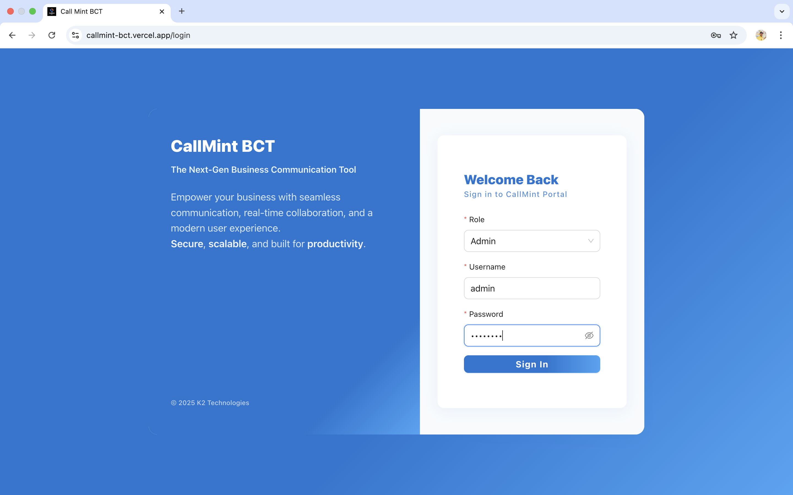
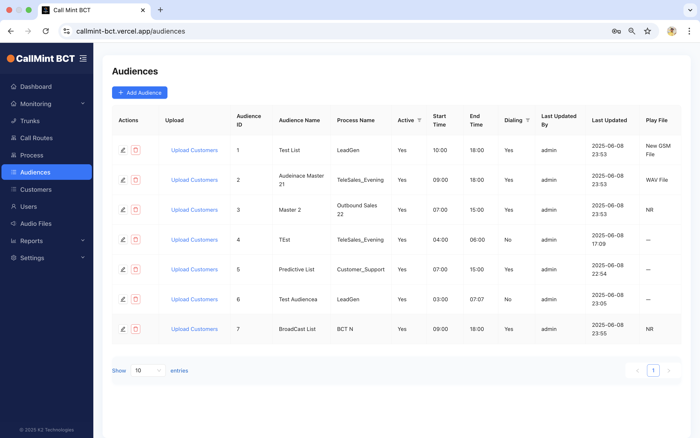
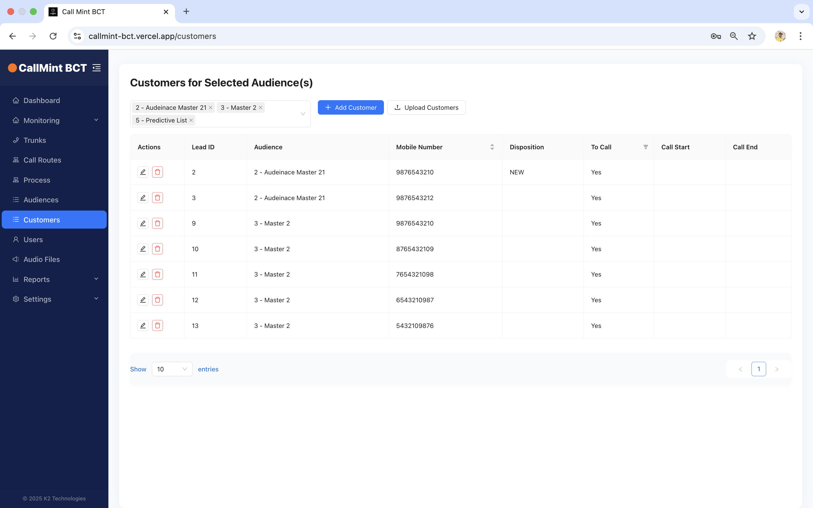
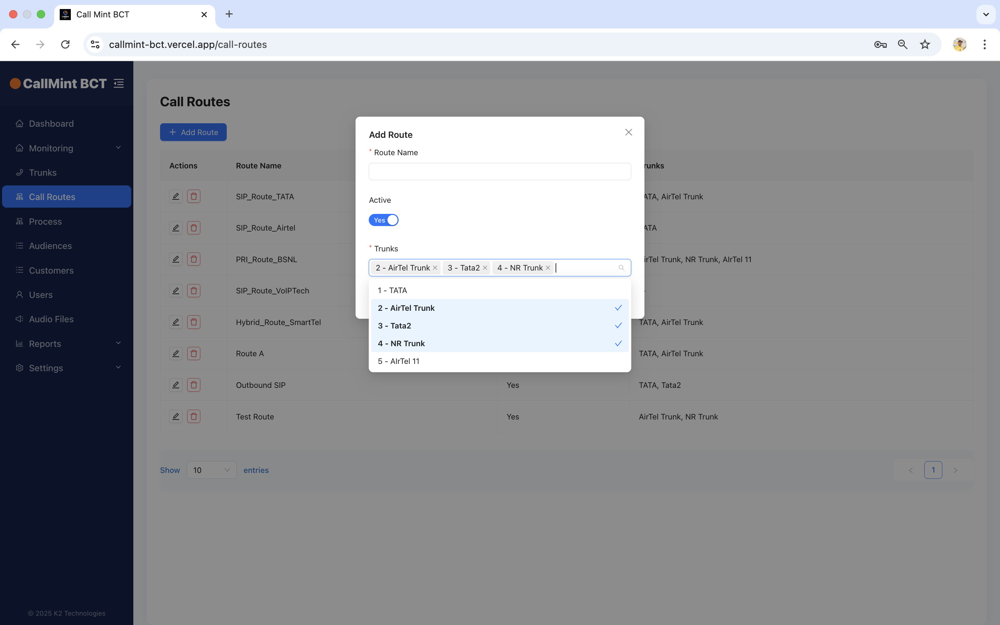
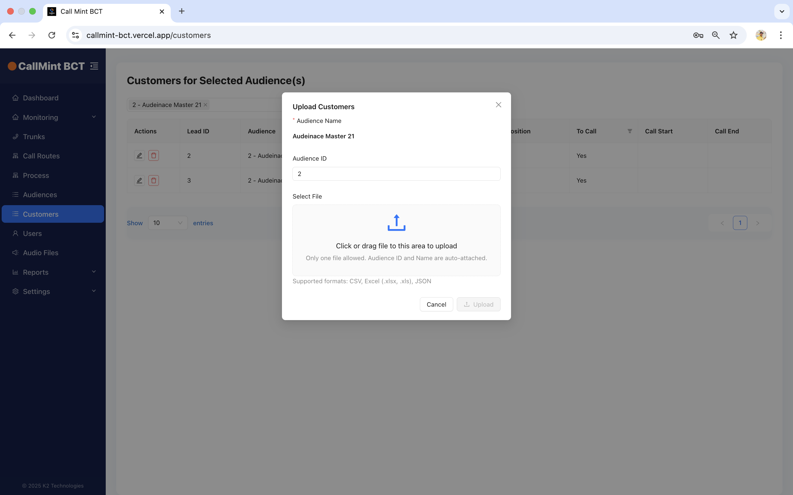

# CallMint BCT – Bulk Voice Communication Tool

🔒 *Code is proprietary and under NDA – request access for demo.*

## 🔹 Features
- Upload and broadcast voice messages to customer lists
- Accept DTMF input for user response tracking
- Real-time status and delivery reports
- Integrated License Manager for access control

## 💻 Stack Used
- React + Ant Design (Frontend)
- Node.js + Express.js (Backend)
- MySQL + Sequelize ORM
- Hosted: Vercel (Client) + Render (Server)

## 📸 Screenshots

## 🔗 Live Demo (Restricted Access)
